# Faster R-CNN on BDD100K using PyTorch
[](https://hub.docker.com/r/anupamkliv/bdd100k)
[](https://github.com/pylint-dev/pylint)

Images along with bounding boxes and scores present in BDD100K dataset for object detection
<div align="left">
  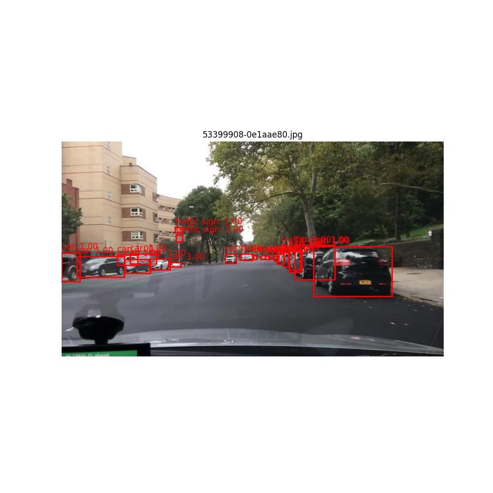
  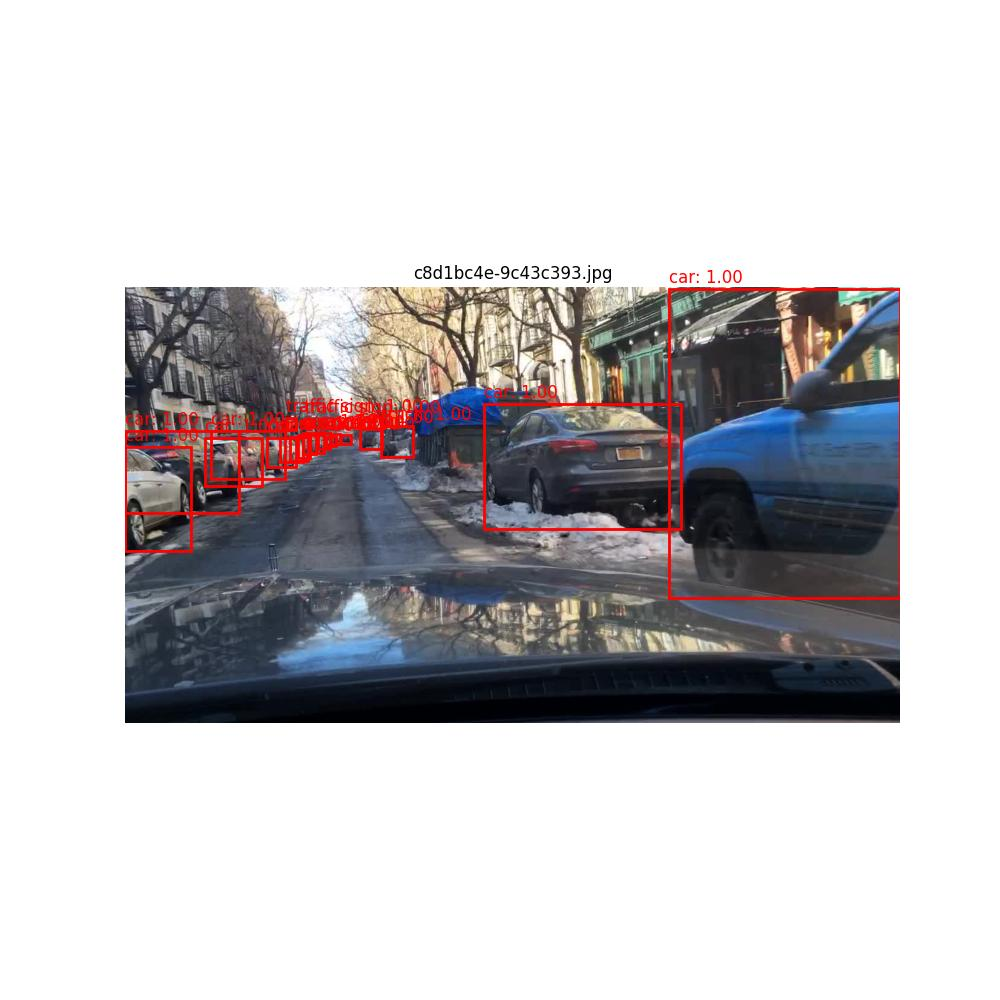 
</div>

## Installation

- Its advisible to create an conda environment

```
conda create --name env
conda activate env
```
- Install the latest version from source code:
```
$ git clone https://github.com/anupamkliv/bdd100k.git
$ pip install -r requirements.txt
```

- Using Docker

Create a docker image
```
 docker build . -f Dockerfile.py -t #image_name .
```
Provide #image_name as required

Run the docker image

```
docker run #image_name
```
In line 17 of the docker file use the python file name for which the docker image needs to be made.

## Documentation

This repo consist of 3 three things

1. Dataset overview
2. Training
3. Inference

Training and inference are done using the same train.py file
## 1. Dataset overview

```
python dataset.py \
 --all_stats 1 \
 --train_stats_attribute 0 \
 --imbalance 0 \
 --unclear_image 0 \
 --traffic_light 0 \
 --area_stats 0 \
 --visualize_dataset 0 \
....
```

## 2. Training and inference

```
python train.py \
 --lr 0.001 \
 --batch_size 8 \
 --epochs 2 \
 --model fasterrcnn_resnet50_fpn \
 --train 1 \
 --iou_thres 0.5 \
 --prob_thres 0.02 \
....
```


## Arguments during Dataset Overview and Training& Inference

### Dataset Overview

| Argument   | Description                                                  | Default |
| ---------- | ------------------------------------------------------------ | ------- |
| all_stats  | if 1 it will give all the statistics                          |   1     |
| train_attribute | get no of images of each attribute from train set   |   0     |
| valid_attribute | get no of images of each attribute from valid set    |   0     |
| imbalance       | gives class and sample imbalance statistics                       |   0     |
| unclear_image   | gives number of blur images                             |   0     |
| traffic_light   | gives where trafficlightcolor is None                   |   0     |
| area_stats      | determines the mean and std of areas in the bounding box (BB)           |   0     |
| visualize_dataset| original and bounding box visualization             |   0     |
| number_visualize| number of images to be visualized                       |   3     |
| train_json	  | label file for training dataset               	            |   dataset/bdd100k_labels_release/bdd100k/labels/bdd100k_labels_images_train.json |
| label_json      | label file for validation dataset		                     |   dataset/bdd100k_labels_release/bdd100k/labels/bdd100k_labels_images_val.json   |
| train_images	  | path for train images          			                       |   dataset/bdd100k_images_100k/bdd100k/images/100k/train     |
| label_images	  | path for validation images              		               |   dataset/bdd100k_images_100k/bdd100k/images/100k/val       |


### Training & Inference

| Argument   | Description                                                  | Default |
| ---------- | ------------------------------------------------------------ | ------- |
| lr	     | specifies learning rate used during training                 | 0.001   |
| batch_size | specifies dataset batch size                                 | 8       |
| epochs     | specifies epochs during training                      | 2       |
| model      | specifies network architecture                               | fasterrcnn |
| img_dir    | specifies image directory                                    | dataset/bdd100k_images_100k/bdd100k/ |
| label_dir  | specifies label directory                                    | dataset/bdd100k_labels_release/bdd100k/ |
| train     | specifies whether to train or only inference                  | 1       |
| iou_thres | specifies the IoU threshold taken for mAP                    | 0.5       |
| prob_thres | specifies score threshold to visualize BB                   | 0.02       |
| train_images | specifies the number of images to be taken during training | 50       |
| val_images | specifies the number of images to be taken during inference  | 3       |


## Architecture
Files architecture of this repo. These contents may be helpful for users to understand our repo.

```
|── bdd100k
│   ├── configs
│   │   ├── test_eval.json 
│   │   └── test_train.json
│   ├── dataset
│   │   ├── bdd100k_images_100k
│   │   └── bdd100k_labels_release
│   ├── dataset_info
│   │   ├── dataset_info.py
│   │   ├── plot.py
│   │   └── utils.py
│   ├── test
│   │   └── unittests.py
│   ├── utils
│   │   ├── dataset.py
│   │   ├── evaluation.py
│   │   ├── model.py
│   │   ├── trainer.py
│   │   ├── train_utils.py
│   │   ├── transformations.py
│   │   └── visualize.py
│   ├── dataset.py
│   ├── train.py
│   ├── Dataset_information.ipnyb
│   ├── Dockerfile
│   └── requirements.txt

       
```
Download the dataset from: <a href="https://drive.google.com/file/d/1NgWX5YfEKbloAKX9l8kUVJFpWFlUO8UT/view">Link</a> and prepare the dataset in the following structure. 
```
|── dataset
│   ├── bdd100k_images_100k
│   │   └── bdd100k
│   │       └── images
│   │           └── 100k
│   │               ├── train
│   │               ├── val
│   │               └── test
│   └── bdd100k_labels_release
│       └── bdd100k
│           └── labels
│               ├── bdd100k_labels_images_train.json
│               └── bdd100k_labels_images_val.json

```
## Running tests

An example of test case is available in the `test` directory. To run the test, run the following command from the root directory:

```
python -m test.unittests
```

### Datasets Supported

| Dataset                | Training samples         | Validation samples | Classes 
| ---------------------- | ------------------------ | ------------------ | ------------------ |
| BDD100k <a href="https://doc.bdd100k.com/format.html#object-detection">Dataset</a>  | 70,000                   | 10,000             | 10                 |

### Data Partition

We provide prospect of the dataset. Here we show snapshot for some of the statistics.

#### Frequency of classes present in training and validation set

<div align="center">
  
  
</div>


#### Number of images present in training and validation w.r.t classes

<div align="center">
    
     
</div>

   
</div>

## Models Supported

This repo has support for the following Deep Learning model, which are loaded from `torchvision.models`:

* FasterRCNN <a href="https://pytorch.org/vision/stable/models/faster_rcnn.html">Torchvision</a>

## Dominance of Car, Traffic sign and Traffic Light
Random 3 images taken from Training set
<div align="center">
  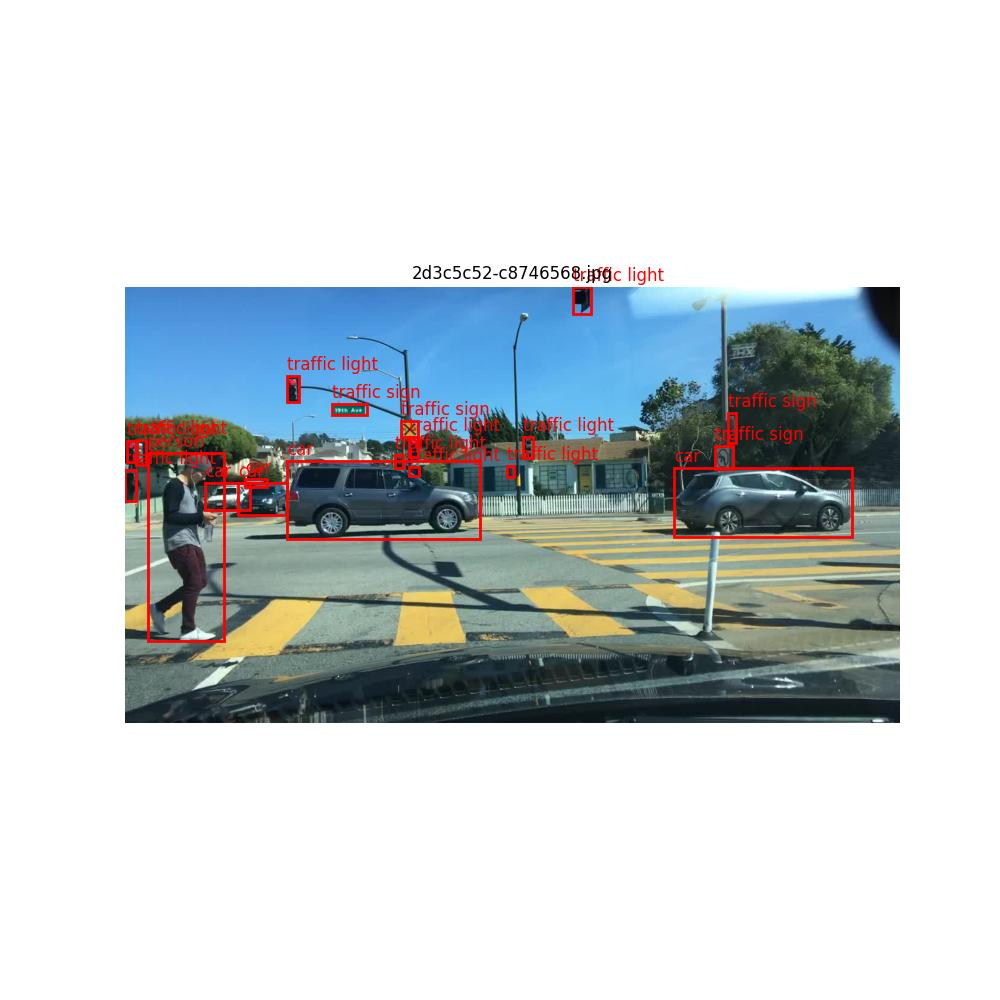
  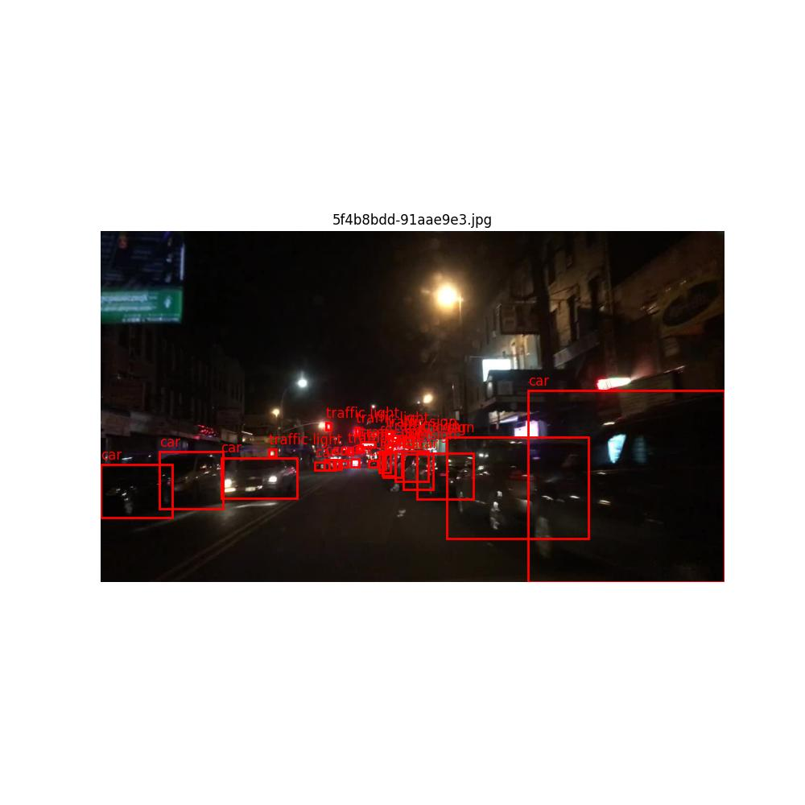 
 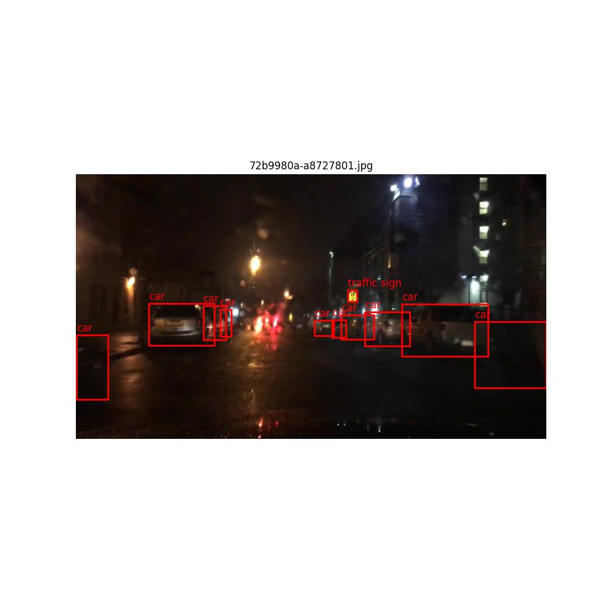
</div>

Random 3 images taken from Validation set
<div align="center">
  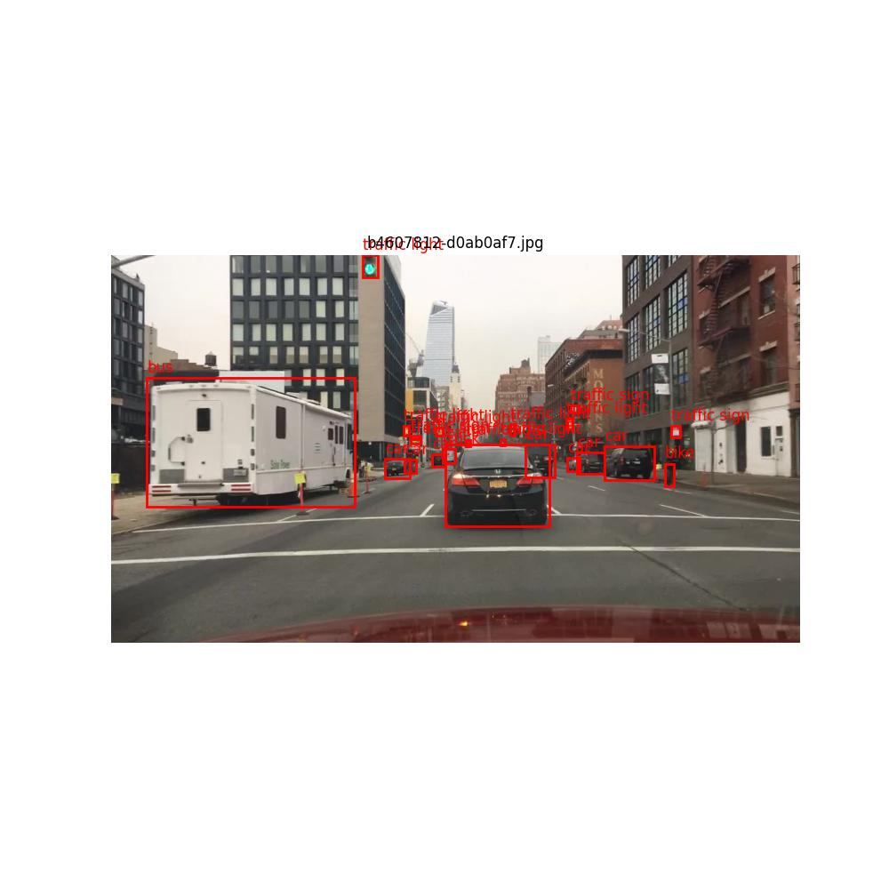
  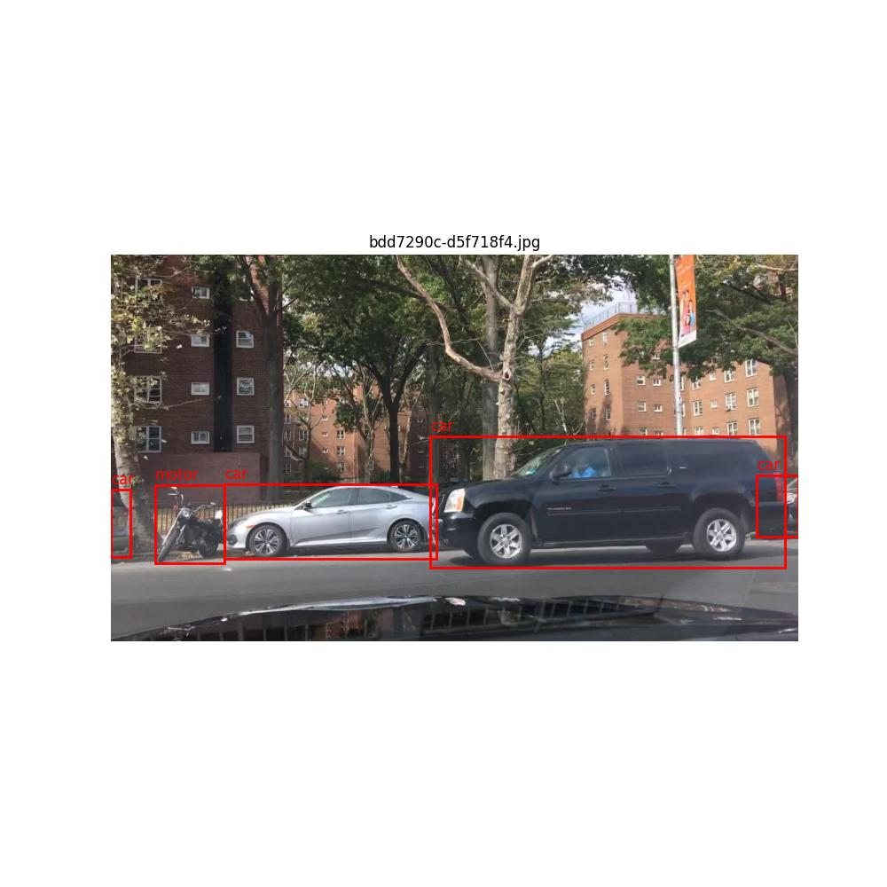 
 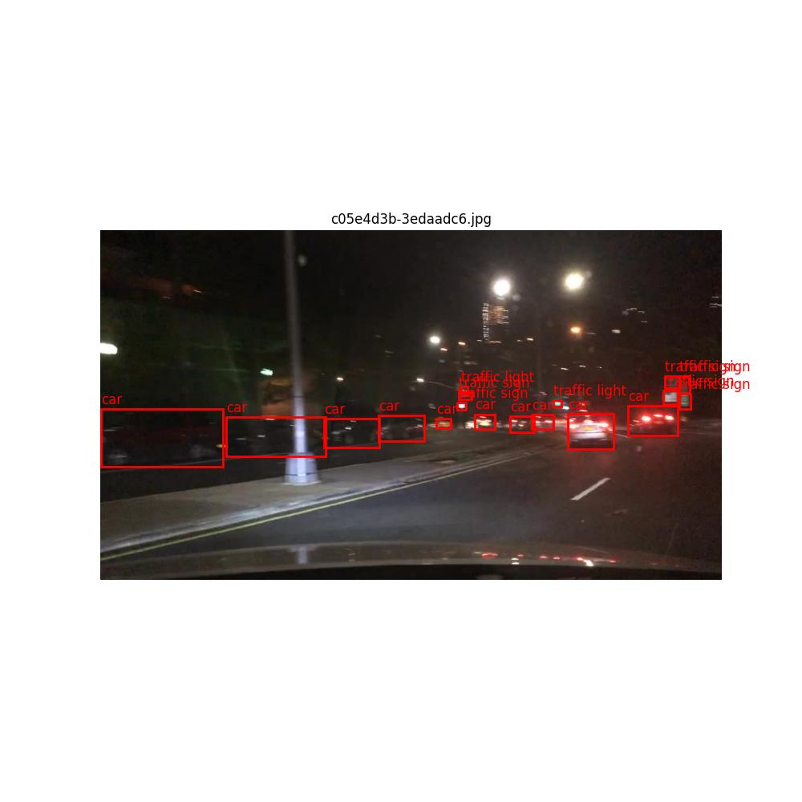
</div>

## Incorrect ground truth
Validation set
<div align="center">
  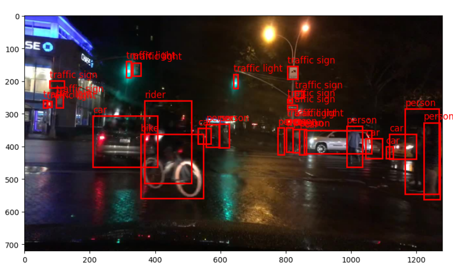
  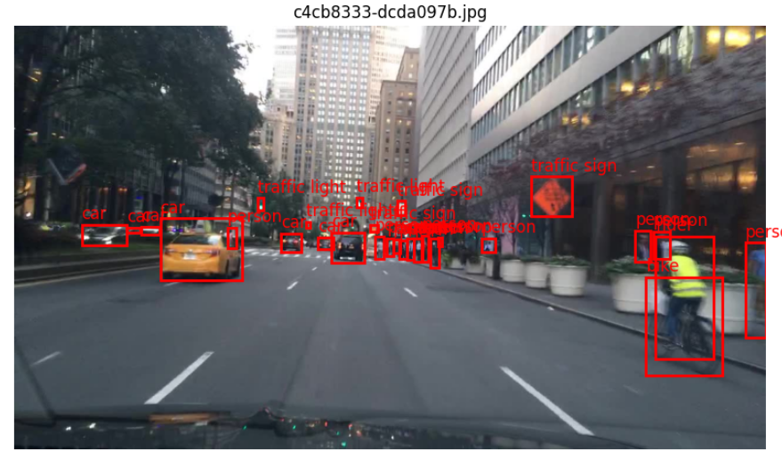 
 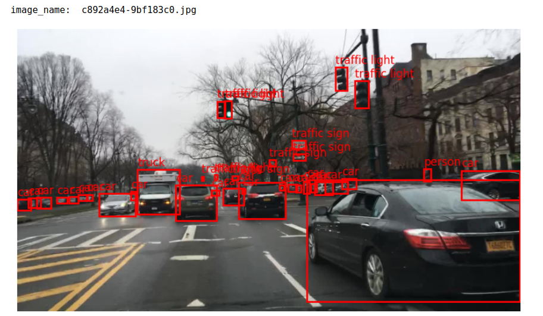
</div>
 
## References 

<a id="1">[1]</a> Ren, Shaoqing, et al. "Faster r-cnn: Towards real-time object detection with region proposal networks." Advances in neural information processing systems 28 (2015). <a href="https://proceedings.neurips.cc/paper/2015/file/14bfa6bb14875e45bba028a21ed38046-Paper.pdf">Link</a>

## Contact

For technical issues, please contact our development team through Github issues or email:


**Contributor**

<a href="https://in.linkedin.com/in/anupam-borthakur-b85000185/">Anupam Borthakur</a> </br>
Centre of Excellence in Artificial Intelligence, </br>
Indian Institute of Technology Kharagpur </br>
email: anupamborthakur@kgpian.iitkgp.ac.in </br>
Github username: anupamkliv

 
